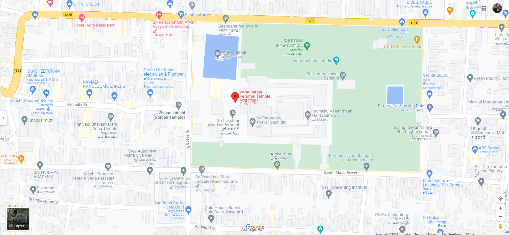
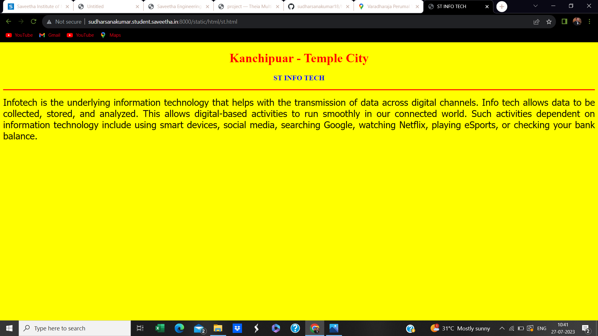
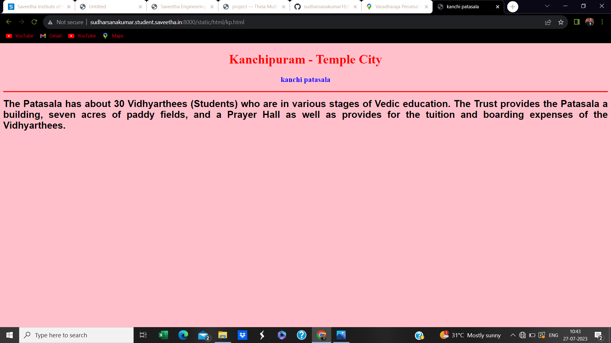
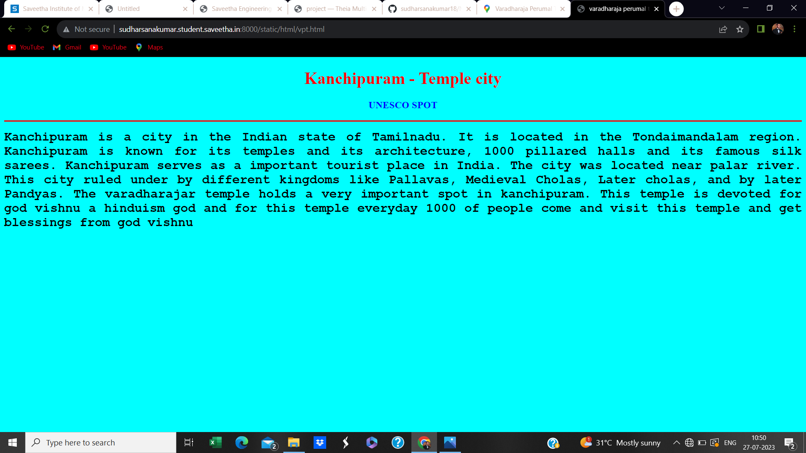
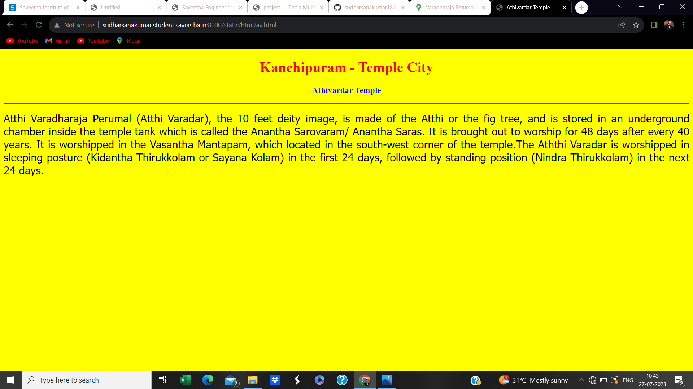
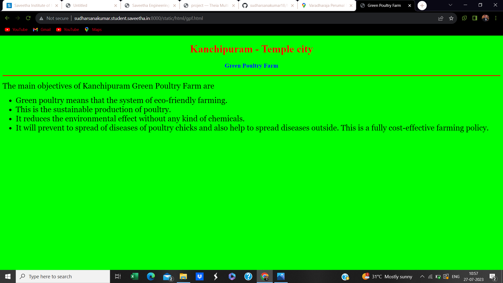
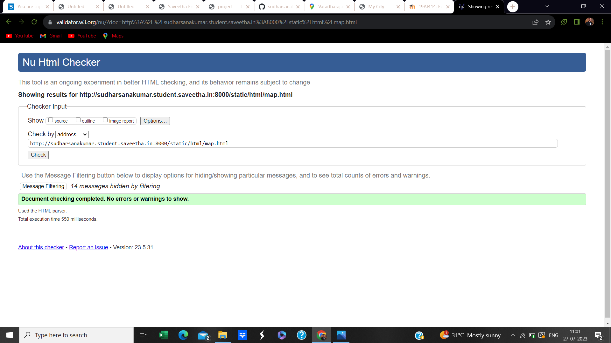

# Ex04 Places Around Me
## AIM
To develop a website to display details about the places around my house.

## DESIGN STEPS

### STEP 1
Clone the github repository into Theia IDE

### STEP 2
Create a new Django project

### STEP 3
Write the needed HTML code

### STEP 4
Run the Django server and execute the HTML files

## CODE
```
map.html

<!DOCTYPE html>
<html lang="en">
<head>
<title>My City</title>
</head>
<body>
<h1 align="center">
<font color="red"><b>Kanchipuram</b></font>
</h1>
<h3 align="center">
<font color="blue"><b>sudharsanakumar (23007374)</b></font>
</h3>
<center>

<map name="MyCity">
<area shape="circle" coords="190,50,20" href="/static/html/vpt.html" title="Varadharaja Permual Temple">
<area shape="circle" coords="230,30,260,30" href="/static/html/gpf.html" title="Green Poultry Farm">
<area shape="circle" coords="400,350,50" href="/static/html/av.html" title="Athi vardhar temple">
<area shape="circle" coords="400,200,75" href="/static/html/kp.html" title="kanchi patasala">
<area shape="rectangle" coords="490,150,870,320" href="/static/html/st.html" title="ST info tech">
</map>
</center>
</body>
</html>

st.html

<!DOCTYPE html>
<html lang="en">
<head>
<title>ST INFO TECH</title>
</head>
<body bgcolor="yellow">
<h1 align="center">
<font color="red"><b>Kanchipuar - Temple City</b></font>
</h1>
<h3 align="center">
<font color="blue"><b>ST INFO TECH</b></font>
</h3>
<hr size="3" color="red">
<p align="justify">
<font face="Tahoma" size="5">
Infotech is the underlying information technology that helps with the transmission of data across digital channels.
Info tech allows data to be collected, stored, and analyzed. This allows digital-based activities to run smoothly
in our connected world. Such activities dependent on information technology include using smart devices, social media,
searching Google, watching Netflix, playing eSports, or checking your bank balance.
</font>
</p>
</body>
</html>

kp.html

<!DOCTYPE html>
<html lang="en">
<head>
<title>kanchi patasala</title>
</head>
<body bgcolor="pink">
<h1 align="center">
<font color="red"><b>Kanchipuram - Temple City</b></font>
</h1>
<h3 align="center">
<font color="blue"><b>kanchi patasala</b></font>
</h3>
<hr size="3" color="red">
<p align="justify">
<font face="Arial" size="5">
<b>
The Patasala has about 30 Vidhyarthees (Students) who are in various stages of Vedic education.
The Trust provides the Patasala a building, seven acres of paddy fields, and a Prayer Hall as well
as provides for the tuition and boarding expenses of the Vidhyarthees.
</b>
</font>
</p>
</body>
</html>

av.html

<!DOCTYPE html>
<html lang="en">
<head>
<title>Athivardar Temple</title>
</head>
<body bgcolor="yellow">
<h1 align="center">
<font color="red"><b>Kanchipuram - Temple City</b></font>
</h1>
<h3 align="center">
<font color="blue"><b>Athivardar Temple</b></font>
</h3>
<hr size="3" color="red">
<p align="justify">
<font face="Tahoma" size="5">
Atthi Varadharaja Perumal (Atthi Varadar), the 10 feet deity image, is made of the Atthi or the fig tree, and is stored
in an underground chamber inside the temple tank which is called the Anantha Sarovaram/ Anantha Saras. It is
brought out to worship for 48 days after every 40 years. It is worshipped in the Vasantha Mantapam, which located
in the south-west corner of the temple.The Aththi Varadar is worshipped in sleeping posture (Kidantha Thirukkolam or Sayana Kolam) in the first 24 days, 
followed by standing position (Nindra Thirukkolam) in the next 24 days.
</font>
</p>
</body>
</html>

gpf.html

<!DOCTYPE html>
<html lang="en">
<head>
<title>Green Poultry Farm</title>
</head>
<body bgcolor="lime">
<h1 align="center">
<font color="red"><b>Kanchipuram - Temple city</b></font>
</h1>
<h3 align="center">
<font color="blue"><b>Green Poultry Farm</b></font>
</h3>
<hr size="3" color="red">
<p align="justify">
<font face="Georgia" size="5">
The main objectives of Kanchipuram Green Poultry Farm are 
<ul>
<li>Green poultry means that the system of eco-friendly farming.</li>
<li>This is the sustainable production of poultry.</li>
<li>It reduces the environmental effect without any kind of chemicals.</li>
<li>It will prevent to spread of diseases of poultry chicks and also help to spread diseases outside. This is a fully cost-effective farming policy.</li>
</ul>
</font>
</p>
</body>
</html>

vpt.html

<!DOCTYPE html>
<html lang="en">
<head>
<title>varadharaja perumal temple</title>
</head>
<body bgcolor="cyan">
<h1 align="center">
<font color="red"><b>Kanchipuram - Temple city</b></font>
</h1>
<h3 align="center">
<font color="blue"><b>UNESCO SPOT</b></font>
</h3>
<hr size="3" color="red">
<p align="justify">
<font face="Courier New" size="5">
<b>
Kanchipuram is a city in the  Indian state of Tamilnadu. It is located in the Tondaimandalam region. Kanchipuram is known
for its temples and its architecture, 1000 pillared halls and its famous silk sarees. Kanchipuram serves as a important 
tourist place in India. The city was located near palar river. This city ruled under by different kingdoms like Pallavas,
Medieval Cholas, Later cholas, and by later Pandyas. The varadharajar temple holds a very important spot in kanchipuram.
This temple is devoted for god vishnu a hinduism god and for this temple everyday 1000 of people come and visit this
temple and get blessings from god vishnu
</b>
</font>
</p>
</body>
</html>
```

## OUTPUT












## HTML VALIDATOR


## RESULT
The program for implementing image maps using HTML is executed successfully.
